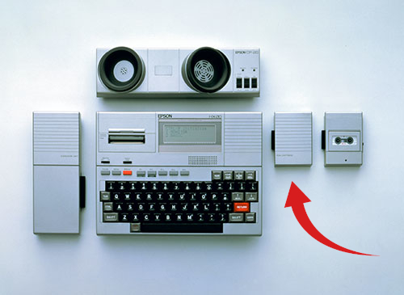
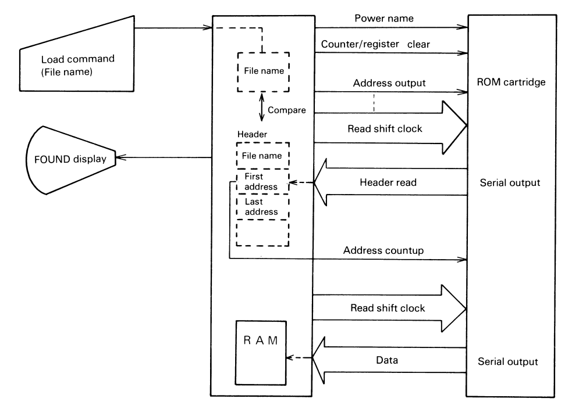
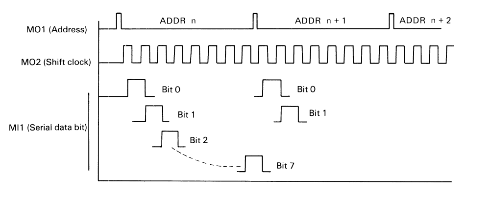
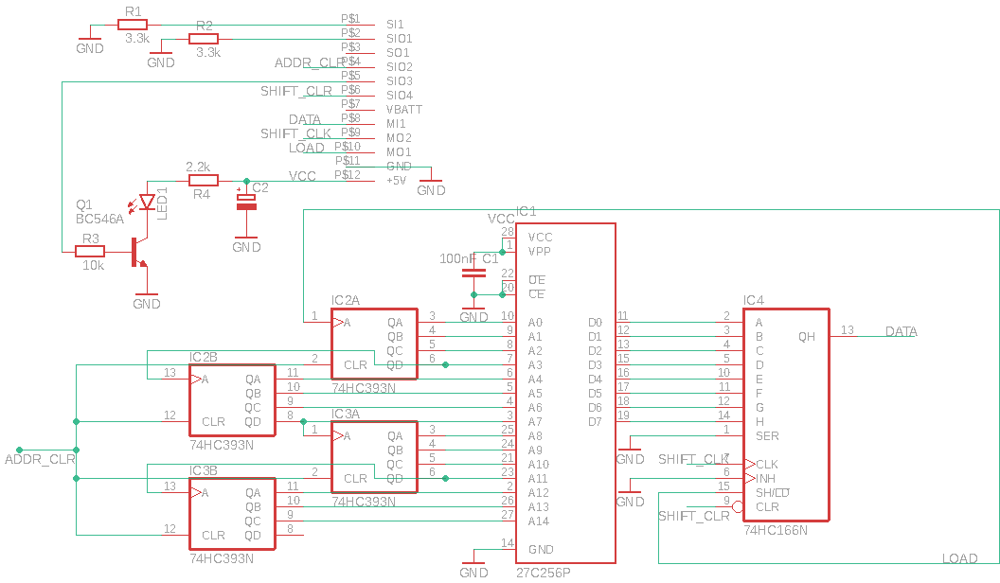
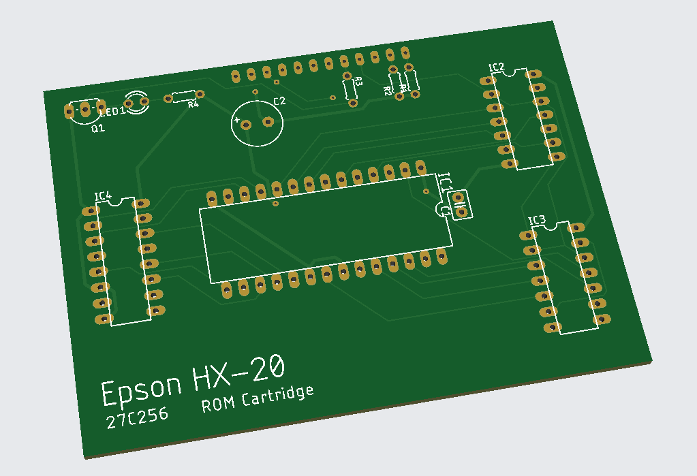
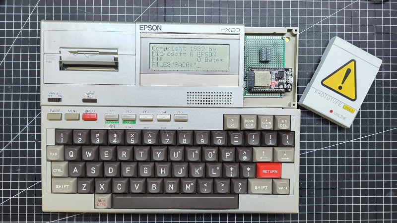

# ROM Cartridges for the Epson HX-20


I find the HX-20 a pretty cool retro computer. Not just because it was the first ultra portable, battery operated handheld computer - in A4 format - that included a display, a printer and, a microcassette drive, but because of it's perky dual processor architecture and it's remarkable industrial design as well. It is a fairly thought through computer with a lot of accessories and endless possibilities for extensions.

I have never seen an original ROM cartridge, so I have decided to create something that would allow me to load programs quickly while on the move - the emphasis is on mobility as **Martin Hepperle's MH-20 Display and Disk Emulator** is the best thing since sliced bread when it comes to development on and for the HX-20. [Find it here](https://www.mh-aerotools.de/hp/hx-20/)



*[Original image is a courtesy of Epson](https://corporate.epson/en/about/history/milestone-products/1982-7-hx20.html)*

### Supporting documents
Fortunately Epson has a great documentation on this product:
* [Technical Manual](doc/tmH_04.pdf) - Chapter 4.2 - coverts the theory of operation and the ROM Cartridge interface.
* Technical Support Document #63a has detailed information on [ROM Format](doc/rom_fomat.md)
* Original 8/16/32k CMOS/NCMOS cartridge [schematic](doc/oschema.png)
* [Photo](doc/ROMCart.jpg) of a disassembled cartridge

#### Theory of operation
Both processors of the HX20 participate in the ROM control process. Main CPU is responsible for addressing and reading data while the register and counter are cleared by the other* CPU. *( *I know how it is called, just trying to be politically correct here. )*


First the address counter and the shift register is cleared. Then the address counter is advanced by M01, then the shift clock (MO2) provides 8 ticks to shift out a single byte serially; and that is read on MI1. That's it. The HX-20 will read the program start address from the ROM header and advance the address counter without shifting out bits until it arrives to the desired address.


## 32K ROM Cartridge
### Schematics
As modern EPROMs are not very power hungry, (J1) power select for non-c-mos type chips have been omitted along with the LDO and the utilization of SIO3 ( ROM Power on signal ). J2A is non-existent = OFF, while J2B connects rom address A14 to the last stage of binary counter output.


### 32K Board
Eagle CAD files, HX-20 cartridge port library and production gerbers are under the [hardware](/hardware) folder.


## ROM Emulator Cartridge
This emulator has an ESP32 in its heart to provide wireless ROM update capability through FTP - although I do see a potential here to use a less power hungry MCU and an SD card. Anyhow, transferring ROM files over WiFi is what I thought was cool. The firmware has been cooked as a platformio project based on the Arduino framework to make it easily portable and accessible for modifications.



:camera: [See it in action](https://photos.google.com/share/AF1QipMuma70FzuCHWNQoMt1CCRNrimfOKazqg87h7Ul6GqiaPwG6kRcX4zg7sMcNq5RkA?key=eUxmN0t5NTZiamtFMTQtWUFrUUo1dGxTRENqZnB3)


#### Interface pinout
Use 5V to 3.3V level shifters on all ESP32 inputs. The only ESP32 output, the data line can be connected directly as the interface operates with TTL levels.

| HX-20 Pin | Signal name | ESP32 Pin | Description |
| -------- | -------- | -------- | -------- |
|1|SI1|-|ROM / Cassette judgement - pulled down |
|2|SIO1|-|ROM / Cassette judgement - pulled down |
|3|SO1|-|Unused|
|4|SIO2|D22|Address counter clear|
|5|SIO3|-| Unused (ROM Power On)|
|6|SIO4|D23|Shift register clear|
|7|VB|VIN|Battery voltage
|8|MI1|D26|Data (Shift register output)|
|9|MO2|D27|Shift register clock|
|10|MO1|D25|Address counter (SHIFT/LOAD select)|
|11|G|GND|Ground|
|12|5V|-|Regulated 5V

#### Current state :warning:
This project is "under development" *( without goals or deadlines )* - there are more than a zillion ways to improve it. Also barely usable in this form, but it satisfies my use case - that is:
* I can create a ROM image on my computer with the help of Martin's `extrom` script. ( Python folder )
* Upload it to the FTP server on the cartridge. ( has to be `pac0.rom` )
* List, load and run the contents of the ROM image on the HX-20.

#### Tweak to use it :warning:

If you would like to play with it ( or make it better ) you'll need to get this repository. I highly recommend platformio ( CLI or through VSCode ) to build it. Don't forget to upload the `data` folder as well, or at least make sure you have formatted the SPIFFS, so that you can land a ROM file on it.

```uint8_t  rom_buffer[8196];``` --- ESP32 has 520K RAM so ...

```const char *ssid = "YOUR_WIFI_AP";```

```const char *password = "YOUR_WIFI_PW";```

At init it will look for `pac0.rom` and load it into `rom_buffer`. There are absolutely no checks whether that happens or not. (yet)
The contents of the filesystem are listed upon boot over serial.

#### All contributions are welcome!

* FTP server that I found is not very reliable. *( maybe assign it to a single core or dump the whole thing for something else )*
* Wifi configuration could be done through AP. ( there are libraries out there for that )
* It doesn't have to be FTP, the ESP could run a small web server with some minimal UI to make it more easier to use.
* There is a bug at initialization, the first character is always read as `1`
* The ESP is using SPIFFS on the internal 4MB flash, that can hold multiple rom files.
* ROM file selection would be great ( there are multiple good ways to do it )
  * **Web based UI** *(would make the most sense if it is used for setting wifi credentials anyway)*
  * OLED screen / buttons ( from design perspective I find it too much )
  * With some trickery *(e.g. mandatory first and last file in a ROM image would trigger rom pack switch)*
* The firmware could handle the ROM image compilation, so that raw binary and basic files could be thrown at it
* Circuit has to be designed that incorporates an LDO and MOSFET switching *( :arrow_up: SIO3 - ROM Power On )*
* I can see a variant that is based on smaller MCU with an SD card as medium. *( this is an easy port )*
* The enclosure of the cartridge needs to be modeled to make it printable

--- all right, by now.
